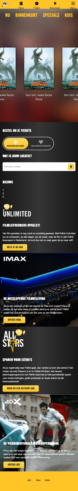
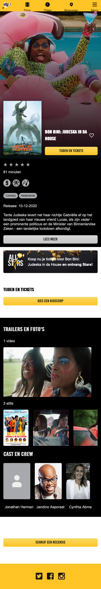
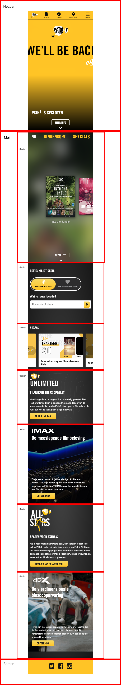
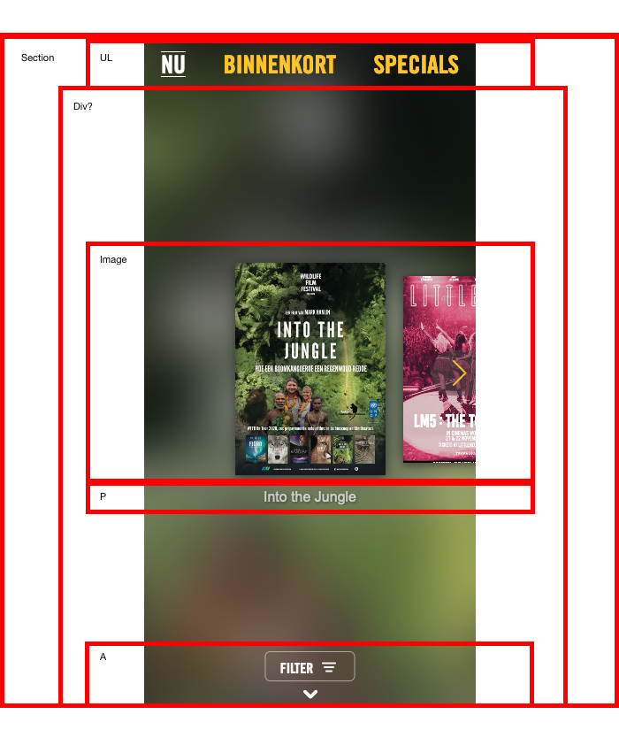
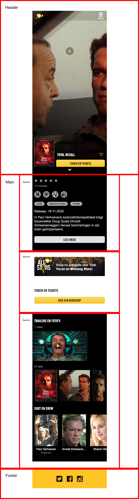
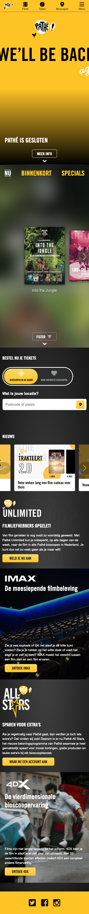
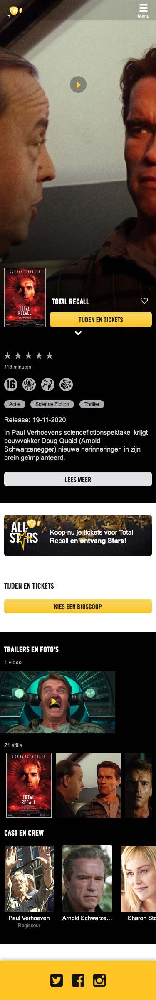

# Procesverslag
**Auteur:** Micky Puck van Dartel

Markdown cheat cheet: [Hulp bij het schrijven van Markdown](https://github.com/adam-p/markdown-here/wiki/Markdown-Cheatsheet). Nb. de standaardstructuur en de spartaanse opmaak zijn helemaal prima. Het gaat om de inhoud van je procesverslag. Besteedt de tijd voor pracht en praal aan je website.

## Bronnenlijst
1. https://www.pathe.nl/film/25509/bon-bini-judeska-in-da-house?position=1
2. https://www.pathe.nl/film/24523/monster-hunter?position=3
3. https://www.pathe.nl/

## Eindgesprek (week 7/8)

-dit ging goed & dit was lastig-

**Screenshot(s):**

-screenshot(s) van je eindresultaat-

## Voortgang 3 (week 6)

-same as voortgang 1-

## Voortgang 2 (week 5)

### Stand van zaken

Ik heb helaas geen huiswerk kunnen maken door andere deadlines. Ik heb er wel naar kunnen kijken en de lessen waren voor de rest heel nuttig. Ik ben deze week voor het gesprek echt hard aan het werk geweest om in ieder geval de 2 pagina's bijna af te hebben zodat ik daarna alle foefjes die we hebben geleerd kan toepassen en eventueel onderdelen van de website te verbeteren.

**Screenshot(s):**

Vanaf hier ging het mij nog vrij goed af. Ik vind flexbox wel nog steeds best moeilijk. Ik moet nog wat dingen toevoegen en aanpassen en kan daarna verder om alle dingen die we hebben geleerd toe te passen aan de 2 pagina's tot hoe ver dit kan.

### Agenda voor meeting

| Denzel | Gerrit | Jessie | Micky | Cesar |
| --- | --- | --- | --- | --- |
| / | / | / |Bronnenlijst| / |
| / | / | / |Comments in einddocument| / |
| / | / | / |Chrome extensie| / |

### Verslag van meeting

## Voortgang 1 (week 3)

### Stand van zaken

Ik vond de eerste 2 opdrachten, positioneren en typografie, erg leuk om te doen. De opdrachten waren soms best uitdagend maar zeker te doen. De hulp die erbij werd gegeven was zeker hulpzaam.

Echter flexbox en javascript waren voor mij echt niet te doen. Ik vond het echt super lastig en de hulp erbij hielp ook niet.

Wat ik ook nog wil zeggen is dat het huiswerk wel erg veel is (in het algemeen). Ik ben hierdoor in de ochtend van de deadline voor front-end nog niet begonnen met de 2 pagina's die vandaag voor 18:00 af moeten zijn. Dit komt ook doordat er 3 deadlines deze week waren, waarvan 2 voor een cijfer. En vandaag hebben we 3 uur les, dus ik kan vandaag ook niet veel doen voor front-end. Ik ben hierdoor erg gefrustreerd.

**Screenshot(s):**

Ik heb nog niks.

### Agenda voor meeting

| Denzel | Gerrit | Jessie | Micky | Cesar |
| --- | --- | --- | --- | --- |
|Selectoren |De dingen die ik wil uitwerken|Background-image|Breakdown schetsen|Desktop V1 ipv Telefoon V1|
|Navigatie |De uitbreiding naar responsive|Transitions tussen fixed en relative header op scrol|Flexbox|Alle content?|
|Orginele website aanpassen|Hoe neem ik huisstijl over|svg image|Lettertypes|Image size, Voorbeeld vorig jaar|

### Verslag van meeting

Uitklapmenu (hamburgermenu) wel namaken van Pathe

Chrome extensie - CSS peeper gebruiken!

Pseudo element gebruiken voor “NU” “KIDS” etc  https://codepen.io/joostf/pen/QGLWqx

Slider van Pathe hoeft 'nog' niet. Maar wel de 3 andere films ernaast plaatsen.

Wel breakpoints in de website.

Website accessible maken voor iedereen. (Met tab overal door heen kunnen)

## Breakdownschets (week 1)

**Screenshot(s) van de eerste pagina breakdownschets:**

**Screenshot(s) van de eerste pagina breakdownschets detailblok:**

**Screenshot(s) van de tweede pagina breakdownschets:**

## Intake (week 1)

**Je startniveau:** Blauwe piste

**Je focus:** Extra aandacht voor de surface laag (surface plane)

**Je opdracht:** Ik heb gekozen voor de Pathe website

**Screenshot(s) van de eerste pagina (small screen):**

**Screenshot(s) van de tweede pagina (small screen):**

