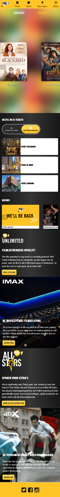
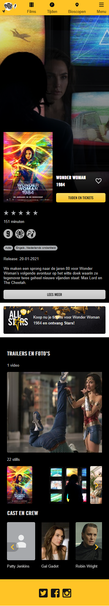
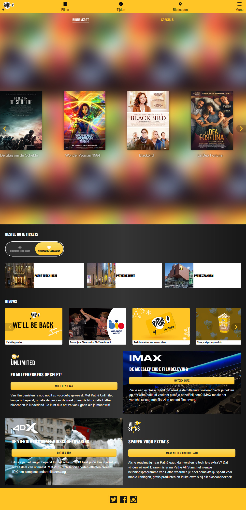
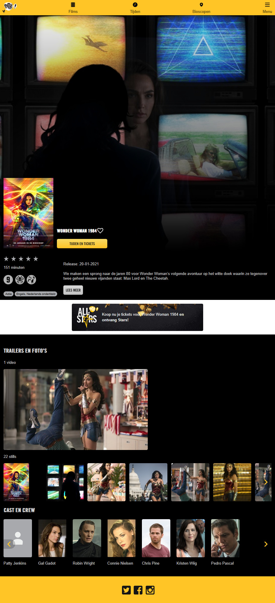

# Procesverslag
**Auteur:** Micky Puck van Dartel

Markdown cheat cheet: [Hulp bij het schrijven van Markdown](https://github.com/adam-p/markdown-here/wiki/Markdown-Cheatsheet). Nb. de standaardstructuur en de spartaanse opmaak zijn helemaal prima. Het gaat om de inhoud van je procesverslag. Besteedt de tijd voor pracht en praal aan je website.

## Bronnenlijst
1. Ik heb alle content gebruikt van deze pagina; https://www.pathe.nl/
2. Ik heb alle content gebruikt van deze pagina; https://www.pathe.nl/film/23289/wonder-woman-1984?position=2
3. Dit font heb ik gebruikt voor de headings https://www.onlinewebfonts.com/download/0f176e527f217797a50cb82e9f62894f
4. Voor de slider heb ik deze CSS en Javascript gebruikt https://splidejs.com/ - https://github.com/Splidejs/splide/releases/tag/v2.4.21
5. https://wdn.unl.edu/page-title-h1-best-practices

## Herkansing

Alle dingen die beter konden of anders moesten heb ik verbeterd. Ik heb voor de structuur van de website en het aantal divjes Sam nog gevraagd om er nog een keer naar te kijken, sinds ik er best veel problemen mee heb gehad in het gehele proces.

## Eindgesprek (week 7/8)

Het responsive maken van mobiel naar desktop ging wel redelijk. Ook vond ik het vervangen van de afbeeldingen en teksten leuk om te doen. Omdat Pathé steeds veranderd met nieuwe films en door de tweede lockdown had ik een oude pagina gebruikt die ik niet meer terug kon vinden. Dus ik moest de afbeeldingen en teksten vervangen.

Al het andere wat ik moest doen vond ik erg lastig. Ik heb er elke dag wel aan gezeten anders wist ik dat ik het niet af zou krijgen.

**Screenshot(s):**

Mobiel:

Desktop:

## Voortgang 3 (week 6)

### Stand van zaken

Ik heb door persoonlijke omstandigheden alleen de feedback van Sam kunnen toepassen op de homepagina.

**Screenshot(s):**

(Dezelfde screenshots als vorige week, omdat ik alleen de semantiek heb veranderd)

### Agenda voor meeting

| Denzel | Gerrit | Jessie | Micky | Cesar |
| --- | --- | --- | --- | --- |
| Nogmaals slimme selectoren | Tables | Meerdere nav’s in html |Bronnenlijst| Werkend winkelmandje? |
| Css tweede pagina (los?) | Lists | Meerdere full screen img onder elkaar |Comments in einddocument| Responsive tot welke resolutie? |
| Fonts | Svg | Hamburger menu |Chrome extensie| Werkende carrousels |
| Svg | / | / | Button op pagina | / |

### Verslag van meeting

In de bronnenlijst kan ik voor de Pathé pagina's erbij zetten dat ik alle content van de pagina heb gebruikt.

Commentaar in het einddocument mag.

Webdeveloper toolbar / view document outline (chrome extensie) is handig om te gebruiken.

Handig:
HTML checker w3 schools.
W3 schools “how to” gebruiken.

Aanpassen:
HTML klopt nog niet helemaal qua structuur.
Die toggle button kunnen tabjes worden.
In de css moeten de PX eruit.

## Voortgang 2 (week 5)

### Stand van zaken

Ik heb helaas geen huiswerk kunnen maken door andere deadlines. Ik heb er wel naar kunnen kijken en de lessen waren voor de rest heel nuttig. Ik ben deze week voor het gesprek echt hard aan het werk geweest om in ieder geval de 2 pagina's bijna af te hebben zodat ik daarna alle foefjes die we hebben geleerd kan toepassen en eventueel onderdelen van de website te verbeteren.

**Screenshot(s):**

Vanaf hier ging het mij nog vrij goed af. Ik vind flexbox wel nog steeds best moeilijk. Ik moet nog wat dingen toevoegen en aanpassen en kan daarna verder om alle dingen die we hebben geleerd toe te passen aan de 2 pagina's tot hoe ver dit kan.

### Agenda voor meeting

(We hadden geen meeting)

### Verslag van meeting

"Grootste opmerking die ik allereerst heb, probeer niet alles in een div te wrappen. Div heeft verder geen semantische waarde en moet je echt alleen gebruiken wanneer je een container nodig hebt om iets vorm te geven.
Zo kan de cover-carrousel prima een section zijn en kunnen alle div's daarbinnen vervangen worden door articles. Kijk hier voor de rest van je site ook nog even goed naar!

De div om je locatie input veld zou bijvoorbeeld weer een form moeten zijn en de location-button een button.

Omdat je in jouw geval classes hebt gebruikt, is het niet enorm veel werk om al deze elementen te veranderen, maar het zou helemaal mooi zijn als je na het verwijderen van de div'jes ook nog eens de classes er uit zou krijgen.

Denk er daarna ook aan dat iedere section en article een eigen heading moeten hebben, dus de filmtitel zou in dat geval de heading kunnen zijn van het article.

Qua vormgeving ziet het er verder al erg goed uit.

Als je er even een half uurtje op gaat zitten om de semantiek goed te krijgen ben je erg goed op weg!"

- Sam Slotemaker

## Voortgang 1 (week 3)

### Stand van zaken

Ik vond de eerste 2 opdrachten, positioneren en typografie, erg leuk om te doen. De opdrachten waren soms best uitdagend maar zeker te doen. De hulp die erbij werd gegeven was zeker hulpzaam.

Echter flexbox en javascript waren voor mij echt niet te doen. Ik vond het echt super lastig en de hulp erbij hielp ook niet.

Wat ik ook nog wil zeggen is dat het huiswerk wel erg veel is (in het algemeen). Ik ben hierdoor in de ochtend van de deadline voor front-end nog niet begonnen met de 2 pagina's die vandaag voor 18:00 af moeten zijn. Dit komt ook doordat er 3 deadlines deze week waren, waarvan 2 voor een cijfer. En vandaag hebben we 3 uur les, dus ik kan vandaag ook niet veel doen voor front-end. Ik ben hierdoor erg gefrustreerd.

**Screenshot(s):**

Ik heb nog niks.

### Agenda voor meeting

| Denzel | Gerrit | Jessie | Micky | Cesar |
| --- | --- | --- | --- | --- |
|Selectoren |De dingen die ik wil uitwerken|Background-image|Breakdown schetsen|Desktop V1 ipv Telefoon V1|
|Navigatie |De uitbreiding naar responsive|Transitions tussen fixed en relative header op scrol|Flexbox|Alle content?|
|Orginele website aanpassen|Hoe neem ik huisstijl over|svg image|Lettertypes|Image size, Voorbeeld vorig jaar|

### Verslag van meeting

Uitklapmenu (hamburgermenu) wel namaken van Pathe

Chrome extensie - CSS peeper gebruiken!

Pseudo element gebruiken voor “NU” “KIDS” etc  https://codepen.io/joostf/pen/QGLWqx

Slider van Pathe hoeft 'nog' niet. Maar wel de 3 andere films ernaast plaatsen.

Wel breakpoints in de website.

Website accessible maken voor iedereen. (Met tab overal door heen kunnen)

## Breakdownschets (week 1)

**Screenshot(s) van de eerste pagina breakdownschets:**

**Screenshot(s) van de eerste pagina breakdownschets detailblok:**

**Screenshot(s) van de tweede pagina breakdownschets:**

## Intake (week 1)

**Je startniveau:** Blauwe piste

**Je focus:** Extra aandacht voor de surface laag (surface plane)

**Je opdracht:** Ik heb gekozen voor de Pathé website

**Screenshot(s) van de eerste pagina (small screen):**

**Screenshot(s) van de tweede pagina (small screen):**

